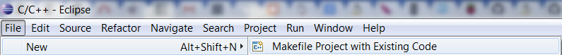
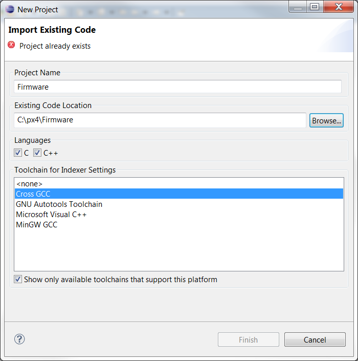
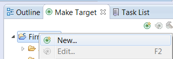

# PX4 Toolchain Installation (Windows)
This article is mostly an adaption of the guideline from (https://pixhawk.org/dev/toolchain_installation_win) available on pixhawk website under category *Developer Manual*.
For compiling the source you do need two files:

+ [PX4 Toolchain](http://www.inf.ethz.ch/personal/lomeier/downloads/px4_toolchain_installer_v14_win.exe)
+ [PX4 Driver](http://pixhawk.org/static/px4driver.msi)

## Initial Setup
Install the PX4 Toolchain and the PX4 Driver on your Microsoft Windows OS. To get an initial software setup you then have to execute the following menu command: **Start -> PX4 Software download**.
**Note:** You do not need to adjust the *PATH* settings.

## Eclipse
The PX4 Toolchain comes with an Eclipse project you can use for development. It is recommended to start the Eclipse IDE over the specific batch file delivered by the PX4 Toolchain: **Start -> PX4 Eclipse**.

If you're working on a 64-bit system there may be an issue starting Eclipse, because of the 64-Bit JRE / JDK. In this case you have to download either the JRE or JDK 32-bit from (http://www.oracle.com/technetwork/java/javase/downloads/index.html). 
If Eclipse starts up it will automatically assume that your PX4 toolchain is located under C:\px4. The PX4 Eclipse will use C:\px4\workspace as its workspace folder.

### Import the existing Makefile Project
1. After starting Eclipse you have to import the PX4 Firmware Makefile project. Go to **File -> New ->  Makefile Project with Existing Code**.

2. Click on **Browse** and choose **C:\px4\Firmware** as your Existing Code Location.
3. As *Toolchain for Indexer Settings* you have to choose the Gnu Cross Compiler **CROSS GCC**
4. **Finish** the *New Project* wizard.

### Creating Make Targets
This step is important so you can build your source code and flash it onto your pixhawk hardware.

1. In Eclipse open the window **Make Target**.
2. Right click on the project **Firmware** and choose **New**.

3. Add the following Make Targets repeating step 2 for each target:

+ *all* - builds the autopilot software (depends on target *archives*)
+ *archives* - builds the NuttX OS
+ *clean* - cleans the application layer only
+ *distclean* - cleans the application layer and the NuttX build
+ *upload px4fmu-v1_default* - uploads to PX4FMU v1.x boards
+ *upload px4fmu-v2_default* - uploads to PX4FMU v2.x boards

## Build
**Note:** Before you are able to build the source with **make all** you have to build the RTOS NuttX itself by executing **make archives**. This takes up to 20 minutes on a current i7 with 8 GB of RAM until it is finished. Afterwards try to execute **make all**. If Eclipse is configured correctly you will be able to build the complete software and later flash it onto the controller.